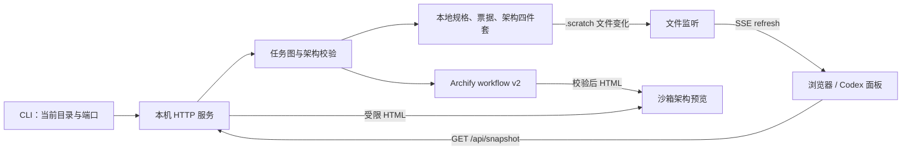

# Matt Task View

本地 Markdown 票据的只读开发进度视图：读取 `.scratch/<feature>/issues/`，在 `127.0.0.1` 提供实时依赖图、进度、开发前沿与任务详情。

适合在 Codex 右侧面板或普通浏览器中跟踪本地开发。规格、票据和架构文件保存在项目内，视图负责读取与解释这些事实。主服务使用 Node.js 标准库和原生 HTML/CSS/JavaScript；任务图由仓库内固定版本的 Archify 运行时生成，无需安装依赖、数据库或前端构建步骤。

**本地 Markdown · Archify 实时依赖图 · 架构版本追溯 · 中文界面 · 开箱即用**


> 实际运行截图：本项目 9 张开发票据已完成，验证与交付独立显示“待记录”。截图仅代表拍摄时的项目状态。

[界面导览](docs/界面导览.md) · [快速运行](#快速运行) · [功能清单](#功能说明) · [认证与请求流程](docs/认证与请求流程.md)

## 本地开发流程

固定顺序是：完成正式规格 → 判断架构影响并通过门禁 → `to-tickets` 发布票据 → 首次 implement。`greenfield` 从规划架构 v0 开始；`existing` 先恢复或固定已验证的当前基线。无架构影响也必须记录非空跳过理由。

任务全部完成后生成 `actual` 实际架构并复核差异；用户显式批准后，才由外部流程把实际四件套精确提升为长期基线。任务视图只读展示整个过程，不批准或复制架构资产。完整字段契约见 companion skill 与票据契约文档。

```sh
matt-task-view serve --port 0
```

在 Codex 中，由 `matt-task-view` companion skill 在 `to-tickets` 后、首次 `implement` 前自动启动或复用服务，并在同一回合将输出地址打开到右侧浏览器面板。

## 界面展示

### 当前工作优先，历史按需查看

默认选择有进行中工单的功能，没有时选择其他待处理功能；每次聚焦一个功能。工单全部完成、没有计划诊断和待处理架构状态的功能收进“已完成”。工单完成但实际架构仍待复核的功能继续留在当前工作。

| 工作概览 | 单个功能的工单 |
| --- | --- |
|  |  |

以上是 Codex 侧栏内的网页实拍，不含 Codex 应用外框。本仓库当前全部工单已完成，因此默认展示历史入口，没有虚构进行中任务。

### 工单执行与设计依据

工单列表优先展示进行中、受阻和可开始的任务，状态筛选只统计当前功能。展开工单查看完整验收项、架构修订、受影响组件和源文件位置。规格卡片仅摘要展示目标、范围和验收标准，完整原文按需展开。

依赖图放在该功能的工单下方，默认收起，展开时才请求 Archify 产物。箭头仅表示工单前置依赖，去除了重复任务按钮和不适用的技术分类图例；真正的系统架构仍在独立的“架构设计”卡片中。


横向概览最多展示 12 项、6 层，完整工单保留在列表和大图详情中；跨功能依赖另行列出。折叠状态在同一页面的数据刷新和功能切换中保留，重新加载恢复默认收起。

### 将架构版本与实施闭环放在同一个视图

架构卡片分别展示当前、目标、实际与长期基线状态；展开大图可阅读规划、人工批准、任务开发和实际复核之间的关系。图中的人工批准是工作流步骤，任务视图本身没有批准操作。


更多截图与逐项解读见 [界面导览](docs/界面导览.md)，包含当前工作、规格摘要、依赖图与架构追溯。

## 功能说明

| 功能 | 当前行为 |
| --- | --- |
| 进度概览 | 展示总任务、已完成、进行中、待开始和阻塞数量；完成率按 `done / total` 计算 |
| 当前工作 | 默认聚焦单个待处理功能，工单作为执行主界面；完成的功能进入折叠历史 |
| 设计依据 | 规格三项摘要与完整原文；架构设计独立展示，验证与交付保持独立提示 |
| 依赖流程图 | 当前功能内默认收起的 Archify 横向图，展开时才加载；可进入完整交互图 |
| 可执行前沿 | 只列出依赖已完成、架构门禁和绑定有效的 `ready` 任务；计划诊断失败时停止给出前沿 |
| 任务筛选 | 状态筛选限定当前功能，显示当前任务、可开始或等待原因，避免不同功能的编号混读 |
| 验收三态 | `[ ]` 尚未实现、`[~]` 已实现未验收、`[x]` 已验收；任务状态和验收项分别展示 |
| 计划诊断 | 检查缺失字段、非法状态、重复 ID、缺失依赖、自依赖和循环依赖，展示源文件位置 |
| 架构追溯 | 将 `architecture_revision`、`affects` 绑定到批准修订及稳定组件 ID，提供有效组件定位链接 |
| 架构生命周期 | 区分规划、实际复核、交付校验、用户批准与长期基线；识别过期批准和被修改的产物 |
| 架构预览 | 经校验的 HTML 在受限 iframe 中展示，也可展开大图；过期规划可以保留上次有效预览，但不能据此开始新任务 |
| 实时刷新 | 监听 `.scratch/` 文件变化，以 SSE 通知浏览器重新读取快照 |
| 本机只读 | 仅监听 `127.0.0.1`，HTTP 只接受 GET，不修改票据或代替用户批准 |

## 快速运行

已在 macOS、Node.js `v24.13.1` 验证。建议使用 Node.js 24；其他系统与版本尚未在本次发布中验证。

```sh
git clone https://github.com/951655087/matt-task-view.git
cd matt-task-view
node src/cli.mjs serve --port 0
```

打开终端输出的 `开发任务视图: http://127.0.0.1:<端口>/`。`--port 0` 自动分配空闲端口；需要固定端口时可传入 `--port 4317`。按 `Ctrl+C` 关闭本次服务。直接运行不需要 `npm install`。

仓库保留自身开发规格、票据及架构记录，可直接查看真实项目状态。架构卡片按当前文件校验结果展示，不保证所有历史阶段都显示为已批准。

### 查看其他项目

服务以**启动命令的当前工作目录**作为读取根目录。将下面路径替换为你克隆的工具位置：

```sh
cd /path/to/your-project
mkdir -p .scratch
node /path/to/matt-task-view/src/cli.mjs serve --port 0
```

`.scratch/` 必须存在，才能建立文件监听；空目录会显示空任务视图。需要短命令时，可在工具仓库内自行执行 `npm link`，之后从目标项目运行 `matt-task-view serve --port 0`。

### 接入 Codex / Matt 工作流

将仓库中的 [companion skill](skills/matt-task-view/SKILL.md) 及其 `references/` 一起放入你的技能目录，并让 `matt-task-view` 命令可用。该 skill 约定在发布本地票据后自动打开 Codex 右侧视图，也支持“启动开发任务视图”。复制技能是单独的本机配置步骤，克隆本仓库不会自动安装技能。

## 数据目录和票据格式

```text
your-project/
├── .scratch/
│   └── feature-name/
│       ├── spec.md
│       ├── issues/
│       │   ├── 01-first-task.md
│       │   └── 02-next-task.md
│       └── architecture/
│           ├── decision.json
│           ├── system.architecture.json
│           ├── system.architecture.html
│           ├── system.architecture.receipt.json
│           └── actual/                 # 实施后的复核四件套
└── docs/architecture/                  # 经外部流程提升的长期基线
```

普通文档任务可在架构决定中记录 `required=false` 和非空跳过理由，省略票据的架构绑定字段。旧项目没有架构文件时保留兼容显示，但这不代表已通过新工作流要求的显式判断。

最小票据示例：

```markdown
---
id: "01"
status: ready
depends_on: []
blocked_reason: ""
phase: "文档"
---
# 01: 完善使用说明

**Status:** ready-for-agent

## 验收
- [ ] 已写明启动方法
- [~] 已补充示例，等待验收
- [x] 已确认读取根目录的规则
```

`depends_on` 的非空列表使用多行形式，例如 `depends_on:` 下一行缩进写 `- "01"`；跨功能引用写 `- "other-feature/01"`。解析器只支持本项目约定的 frontmatter 子集，并非通用 YAML 解析器。完整字段见 [票据契约](skills/matt-task-view/references/ticket-contract.md)。

## 组件、请求流程与认证



本项目**没有账号登录、OAuth、JWT、Session 或 API Token**，也不读取 GitHub 凭据。`127.0.0.1` 限制、只读路由、产物完整性校验与浏览器沙箱构成当前访问边界。SHA-256 是一致性检查，不是登录凭证或用户身份签名。详见 [认证与请求流程](docs/认证与请求流程.md)，包含代码定位、各接口行为及凭据处理说明。

## 验证与项目结构

```sh
npm test
```

使用 Node.js 内置测试运行器；本次发布在 Node.js `v24.13.1` 下通过 108 项测试，覆盖任务图、Archify 适配与交付、架构门禁、生命周期、渲染、HTTP 路由、路径拒绝和 SSE。

| 路径 | 职责 |
| --- | --- |
| `src/cli.mjs` | 命令参数、读取根目录、服务启动和退出 |
| `src/server.mjs` | 只读 HTTP、静态资源、架构与工作流路由、文件监听和 SSE |
| `src/workflow.mjs` | 将当前功能的任务 DAG 转为 Archify workflow v2，并验证交付回执 |
| `src/task-graph.mjs` | 票据解析、依赖校验、开发前沿及架构校验 |
| `src/public/` | 原生浏览器界面、响应式样式与交互 |
| `test/` | 无第三方框架的自动测试 |
| `skills/`、`docs/agents/` | Matt companion、票据契约和本地开发约定 |
| `.scratch/`、`docs/architecture/` | 本项目开发记录及架构事实来源 |
| `prototype/architecture-card/` | 历史布局探索；运行 `npm run prototype:architecture`，与正式任务服务分离 |
| `vendor/archify/` | 固定提交的 MIT Archify 运行文件、许可证与来源说明 |

## 当前边界

- 不提供网页编辑、拖拽改状态、用户权限管理或云端协作。
- 不同步 GitHub/GitLab Issues，不调用远端 API；推送代码到 GitHub 不会自动增加这些能力。
- “验证与交付”目前是提示位，不会自动导入测试、CI 或发布回执。全部任务 `done` 也不会自动变成“已交付”。
- 文件监听范围是 `.scratch/`；只修改 `docs/architecture/` 后需手动刷新页面重新读取。
- 服务每次重新构建快照，适用于本地项目；没有数据库、持久缓存或多租户隔离。
- 当前无身份认证、Host/Origin 白名单或 DNS rebinding 专项防护，不适合直接暴露到公网或共享代理。
- `package.json` 设置 `private: true`，当前通过 Git 克隆使用，没有发布 npm 包。

## 参考

- [Archify](https://github.com/tt-a1i/archify)——任务依赖图固定使用 `06dd052602dd9a369e4d034e24faef0917b5a60c` 的 workflow v2 运行文件，来源和许可证随仓库保留。
- [GitHub：将本地代码加入 GitHub](https://docs.github.com/en/migrations/importing-source-code/using-the-command-line-to-import-source-code/adding-locally-hosted-code-to-github)——本仓库采用已有本地代码的首次推送流程。
