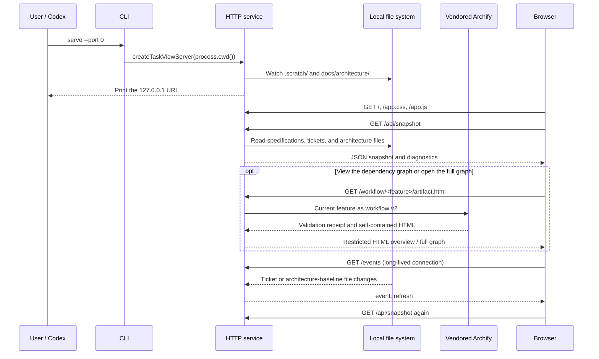

# Authentication, Request Flow, and Credential Handling

[简体中文](认证与请求流程.md) | **English**

This document describes the current implementation of the production task-view service under `src/`. It is a read-only tool for a trusted local environment and has **no application-level authentication**. Any process that can reach the service port can read the task snapshot without a username, password, or token.

## Components and responsibilities

| Component | Code entry point | Responsibilities and boundaries |
| --- | --- | --- |
| CLI entry point | [`parseOptions`, `main`](../src/cli.mjs) | Accepts only `serve`, validates the port and local host, and uses `process.cwd()` as the root directory |
| HTTP service | [`createTaskViewServer`](../src/server.mjs) | Always listens on `127.0.0.1`; every endpoint accepts GET only |
| Data reader | [`buildTaskGraph`](../src/task-graph.mjs) | Reads local specifications, tickets, and architecture files; checks dependencies, status, approved revisions, and actual architecture |
| Workflow adapter and delivery | [`workflowSpecification`, `deliverWorkflow`](../src/workflow.mjs) | Converts each feature's task DAG to workflow v2, invokes the pinned Archify CLI in this repository, and verifies nine checks plus input/output SHA-256 values |
| Artifact access checks | [`architectureFiles`](../src/server.mjs) | Restricts feature directory names and uses `realpath` to reject directory or file symlink traversal on architecture routes |
| Artifact validation | [`architectureSnapshot`, `readVerifiedArchitectureArtifact`](../src/task-graph.mjs) | Checks the decision, source JSON, HTML, and delivery receipt; determines displayability and the development gate |
| Browser UI | [`refresh`, `render`](../src/public/app.js) | Fetches snapshots, escapes and renders text, receives refresh events through `EventSource`, and embeds architecture HTML in a sandbox |
| Development workflow contract | [companion skill](../skills/matt-task-view/SKILL.md) | Defines approval and task-publication order; the view itself has no approval button or write API |

## Normal request flow



Every task dependency graph goes through this workflow route to generate an Archify artifact. The page shows an overview inside a restricted iframe. The task index below the graph uses snapshot data to open ticket details in the main page, while the full-graph action reads the same validated artifact.

The server watches `.scratch/` and `docs/architecture/` and coalesces change notifications with a 30-millisecond delay. An SSE event means only that a file changed; it does not contain the complete task data. The browser fetches the snapshot again after receiving an event. The server removes clients when their connections close, and closes watchers and connections when the process receives an exit signal.

No request passes through authentication middleware: the server does not parse `Authorization`, validate cookies, or exchange tokens. A snapshot contains ticket content, specification excerpts, architecture state, and file paths. Those paths may be absolute local paths, and there is no additional data-redaction layer.

## HTTP endpoints

| Request | Response and checks |
| --- | --- |
| `GET /` | Main HTML with the main-page CSP |
| `GET /app.css`, `GET /app.js` | Fixed asset allowlist; this is not an arbitrary file server |
| `GET /api/snapshot` | Calls `buildTaskGraph` and returns JSON; successful responses use `Cache-Control: no-store`, while read failures return a generic 500 error |
| `GET /events` | Long-lived SSE connection that sends `refresh` events; no credentials required |
| `GET /workflow/<feature>/artifact.html` | Confirms that the feature exists and its name is safe, then sends the current task graph to the pinned Archify version; delivery failures return a generic 422 error |
| `GET /architecture/<feature>/artifact.html` | Validates paths and artifacts; returns sandboxed HTML on success, 409 for a valid path whose artifact cannot be displayed, and 404 for path or read errors |
| `GET /favicon.ico` | 204 |
| Any other path | 404 |
| Any non-GET request | 405 with `Allow: GET` |

## Architecture HTML access flow

1. Decode the feature name in the URL and reject an empty value, `.`, `..`, slashes, backslashes, and NUL characters.
2. Resolve the root directory's real path and verify that `.scratch`, the feature directory, the architecture directory, and the four files do not traverse symlinks.
3. Read `decision.json`, `system.architecture.json`, `system.architecture.html`, and `system.architecture.receipt.json`.
4. Validate the structure, the receipt's SHA-256 values, and byte counts before calculating display state.
5. On success, return the HTML with `no-store`, `nosniff`, a `same-origin` resource policy, and a restricted CSP. The frontend iframe also uses `sandbox="allow-scripts"`.

The artifact CSP allows inline scripts and styles so the generated diagram can operate, but blocks network connections, objects, and form submissions. The sandbox does not grant `allow-same-origin`. Clipboard and fullscreen permissions are disabled. The main page restricts script, style, connection, and iframe sources to itself.

**Displayability and executability are separate decisions.** If the source JSON changes while the last delivered HTML still matches a valid receipt, the interface can display that last valid graph while marking its approval stale and blocking related new tasks. If the HTML changes and no longer matches its receipt, the service stops returning the artifact. See the related regressions in [server.test.mjs](../test/server.test.mjs).

The `realpath` checks above belong to the architecture HTML route. They do not imply that every snapshot file read has the same file-system isolation. The project root and local users with permission to write its files are part of the current trust boundary.

## Archify task-graph generation flow

1. Apply the same character rejection used by the architecture route to the feature name, and confirm that the feature exists in the current `TaskGraph.features`.
2. Select only the tasks for that feature. Dependency levels become left-to-right columns, and parallel tasks within a level enter separate swimlanes. A compact overview shows at most the first 12 nodes and first six dependency levels; all tasks remain available in the Archify task-index cards and the page's task list.
3. Write workflow v2 JSON to a temporary directory and invoke the vendored `archify deliver workflow --quality showcase --json`. Version checks are explicitly disabled, so generation does not access the network.
4. Return HTML only when delivery succeeds, all nine checks pass with no errors or warnings, and both the input JSON and output HTML digests match the receipt. Then remove the temporary directory.
5. Reuse successful results for the same feature and specification within the current service process. A generation failure clears the cache so the next request can retry.

The Archify source, pinned commit, MIT license, and third-party notices are recorded in [`vendor/archify/UPSTREAM.md`](../vendor/archify/UPSTREAM.md). Task-graph responses reuse the architecture artifact's CSP, sandbox, permissions policy, and network restrictions.

## Credential and token handling

| Item | Current handling |
| --- | --- |
| Usernames and passwords | There is no user system; the service does not receive, store, or validate them |
| OAuth / JWT / API keys | Not implemented; the service does not create, refresh, revoke, or transmit application tokens |
| Cookies / sessions | The service does not set session cookies or create server-side sessions |
| Persistent browser credentials | The production frontend does not use localStorage or sessionStorage for credentials. The selected view, feature, filter, and ticket are retained through URL query parameters, which are not credentials |
| GitHub credentials | The application does not access GitHub or read GitHub CLI configuration, the operating-system keychain, or Git credential helpers |
| Archify | Uses pinned runtime files from the repository, disables update checks, accepts no credentials, and calls no remote API |
| Architecture SHA-256 | Pins file revisions and verifies integrity; it is an ordinary digest, not a secret, and does not prove the writer's identity |
| Approval fields | Reads declared approval digests from local JSON and compares them with the current bytes; the external workflow is responsible for real human approval |

For example, the CLI enforces the local-only host as follows:

```js
if (host !== "127.0.0.1") throw new Error("For local privacy, matt-task-view only listens on 127.0.0.1.");
```

The server also fixes the listen address:

```js
server.listen({ host: "127.0.0.1", port }, /* startup callback */);
```

These controls limit network reachability but do not identify “who the current user is.” A person with permission to write local files can modify the artifacts, receipts, and approval fields together; an unkeyed digest cannot prevent such a coordinated rewrite.

Pushing code to GitHub is a separate Git/CLI operation. Authentication is handled by the tool performing the push and its credential store, not by this application's HTTP service. Do not write personal tokens into this repository. `.gitignore` excludes common `.env` files, but it is not a content-redaction or secret-scanning system.

## Scope and verification

The service is intended for a trusted local environment. It does not provide multi-user isolation, TLS, Host/Origin allowlists, dedicated DNS-rebinding protection, or access auditing. CSP, read-only methods, and loopback listening do not replace authentication. Exposing the service through a shared endpoint requires a separate access-control design.

The architecture gate affects the interface and executable frontier. It does not stop other programs from editing tickets directly, running code, or creating Git commits. It provides fact validation and workflow guidance, not operating-system permission enforcement.

Run `npm test` to verify the existing regressions for non-loopback host rejection, encoded-path and symlink rejection, artifact-tampering rejection, stale-artifact behavior, SSE, architecture approval, and baseline validation. Passing the current tests does not mean the project has undergone a public-network security audit.
