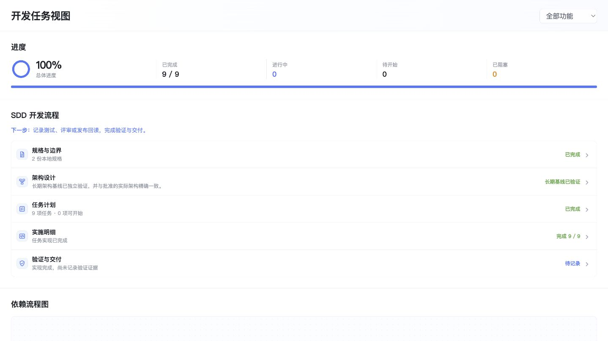
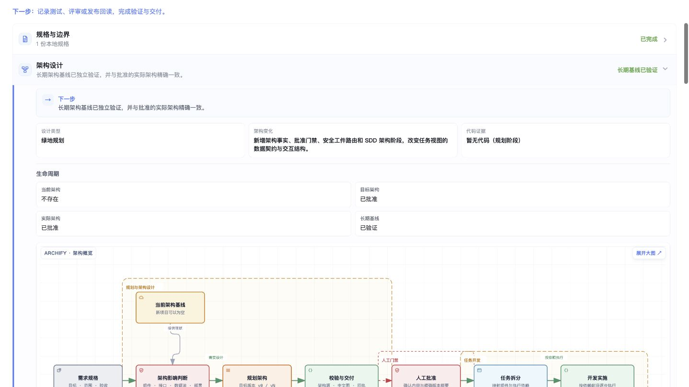
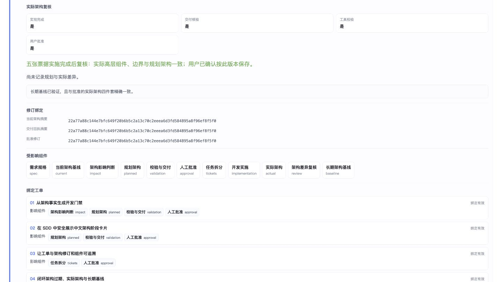
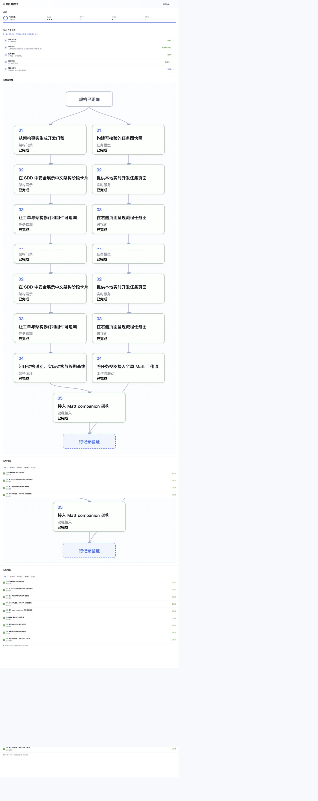

# 开发任务视图 · 界面导览

以下图片均来自本仓库正式服务的真实运行页面，拍摄于 2026-09-04。展示的数据是本项目已有开发票据与架构记录；没有为截图制造正在开发、阻塞或批准状态。宽屏截图用于展示细节，界面也有面向 Codex 窄面板的响应式样式。

## 01 / 先知道进展，再知道下一步



- **右上角功能选择器**：切换全部功能或一个功能目录；进度、流程、任务图与列表随之更新。
- **进度区域**：圆环与分段条表达完成比例，旁边分别显示已完成、进行中、待开始和阻塞数量。
- **下一步提示**：根据任务诊断、架构门禁、实施和复核状态显示当前行动建议。
- **SDD 五阶段**：规格与边界 → 架构设计 → 任务计划 → 实施明细 → 验证与交付。

截图中的 `9 / 9` 表示票据已标记完成。“验证与交付”仍为“待记录”，因为当前界面没有自动导入测试或发布证据的功能；不能从 100% 推断上线完成。

## 02 / 看清架构所处阶段



展开架构卡片后，可看到设计类型、变化说明，以及四个独立阶段：当前架构、目标架构、实际架构、长期基线。示例为绿地项目：当前架构可以不存在，目标和实际架构已经批准，长期基线已验证。

卡片里的“代码证据”来自规划展示语义，因此绿地规划显示“暂无代码（规划阶段）”；判断实施后的状态应查看实际架构复核和长期基线。视图保留这些阶段差异，不把规划图自动冒充实际实现。

## 03 / 展开架构全图


点击卡片中的“展开大图”可查看已有 Archify HTML。图中用不同区域区分规划与设计、人工门禁、任务开发、复核与沉淀；箭头说明从规格到长期基线的流程关系。

该页面由已交付的架构 HTML 提供，任务服务负责路径和完整性校验、受限响应头及隔离展示。图表中的“人工批准”是流程节点；页面不能修改批准文件。示例图表的工具栏属于这份 Archify 产物，并非所有自定义 HTML 都保证具备相同工具。

## 04 / 查看修订与工单是否对应



实际架构复核将“实现完成”“交付核验”“工具校验”“用户批准”分开显示。下方同时列出当前架构摘要、交付回执摘要、批准修订及稳定组件 ID。

“绑定工单”把每张工单映射到受影响的架构组件。有效的组件链接可以定位大图节点；批准过期或组件 ID 无效时，视图会显示诊断并限制相关任务进入可执行前沿。

## 05 / 从图中的任务进入验收明细


依赖图节点支持鼠标及键盘选择，点击后定位并展开对应任务。详情包含验收项、架构修订、绑定状态、受影响组件和票据相对路径。

验收标记独立于任务状态：`[ ]` 尚未实现，`[~]` 已实现未验收，`[x]` 已验收。当前截图的该票据全部验收完成，因此显示勾选标记。所有内容来自本地文件，网页不提供编辑或批准按钮。

## 完整工作台长图

下面保留完整页面，便于查看进度、流程、依赖图和任务列表的上下关系。点击图片可查看原图。

<details>
<summary>展开完整工作台截图</summary>



</details>

## 自己运行查看

```sh
git clone https://github.com/951655087/matt-task-view.git
cd matt-task-view
node src/cli.mjs serve --port 0
```

打开终端输出的本机 URL，即可交互查看仓库内的真实记录。更多用法见 [README](../README.md)，认证与数据边界见 [认证与请求流程](认证与请求流程.md)。
