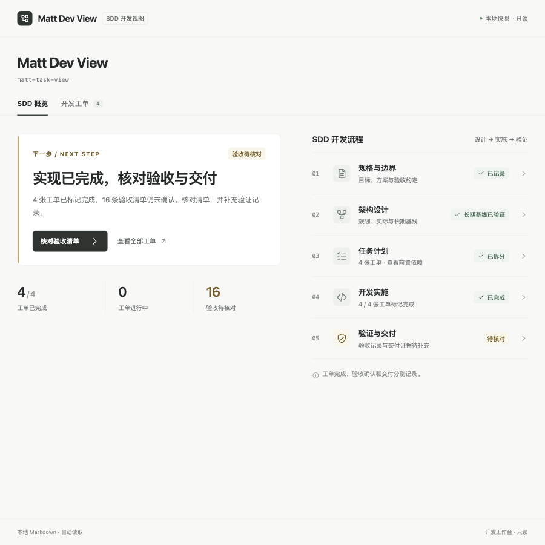
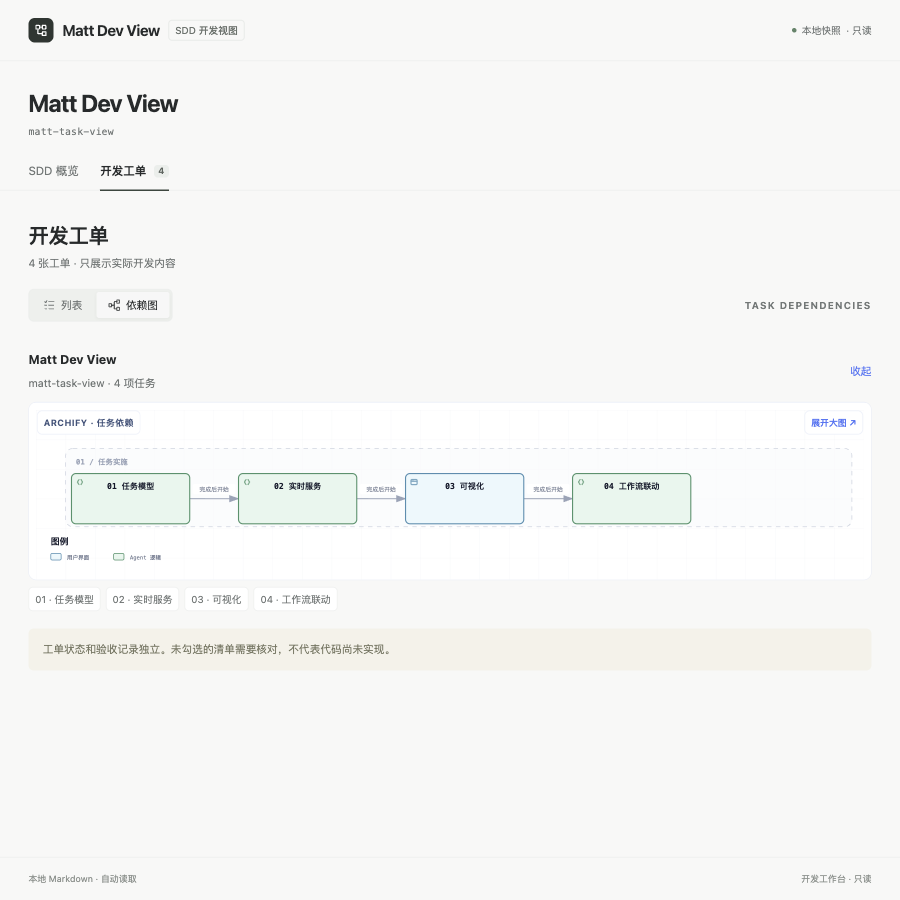
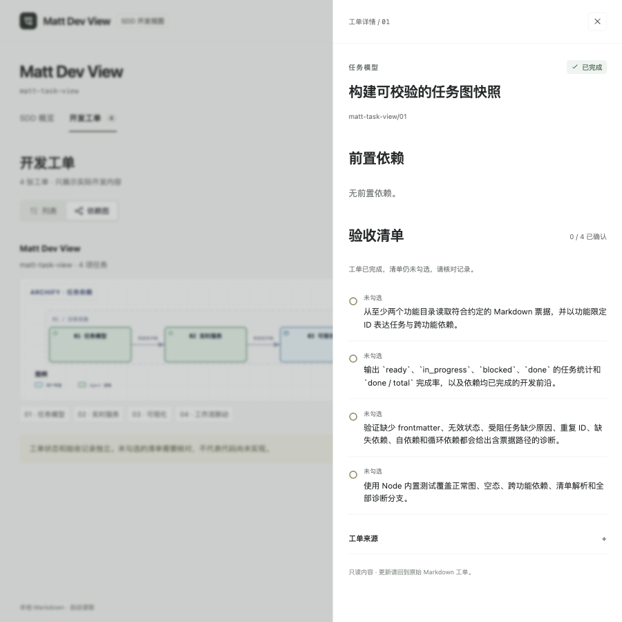
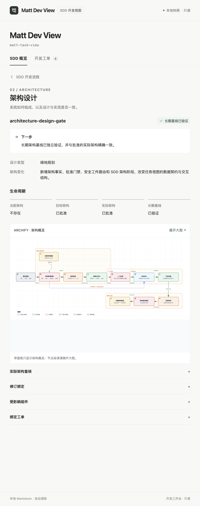
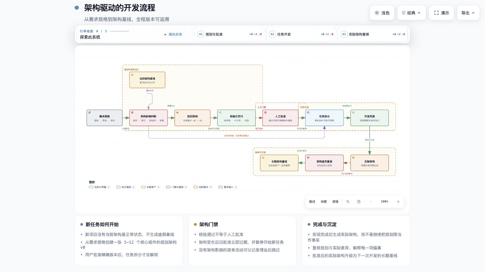
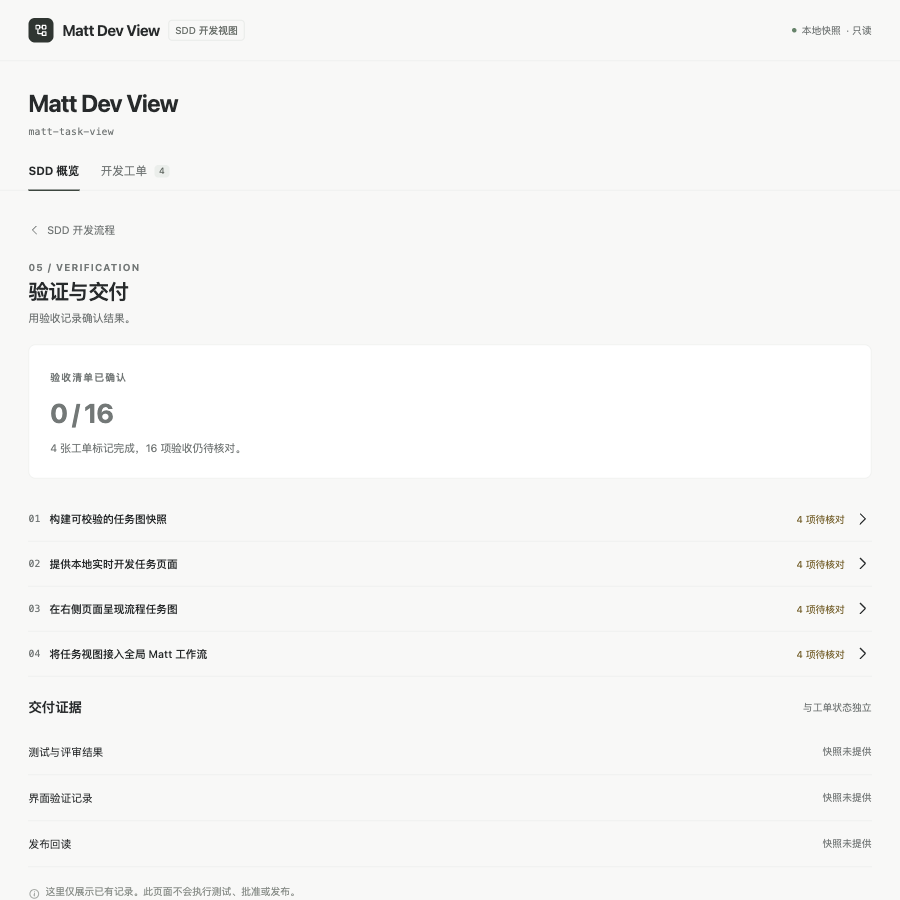

# Matt Dev View · 界面导览

以下截图来自本仓库正式服务的真实运行页面，拍摄于 2026-09-05。它们展示 Codex 内嵌浏览器中的网页，不含 Codex 应用外框。数据来自项目已有 Markdown 工单和架构文件，没有为截图制造执行、阻塞、测试通过或发布状态。

当前示例有 4 张实际开发工单，全部标记为 `done`；16 条验收清单仍未勾选。页面分别展示这两类记录，避免把工单状态当成验收或交付结果。

## 01 / 先知道下一步



页面有“SDD 概览”和“开发工单”两个入口。概览先展示当前行动建议，再显示已完成 / 总工单、进行中工单及待核对验收项。

SDD 流程分为规格与边界、架构设计、任务计划、开发实施、验证与交付五个阶段。每一行给出摘要和状态，点击进入对应内容。示例的下一步是核对验收清单并补充验证记录；不会因 `4 / 4` 工单完成而显示已交付。

存在多个实际开发功能时，功能选择器一次选择一个功能。规格、进度、工单与验收统计随当前功能变化，避免不同功能的 `01、02` 混读。

## 02 / 用列表核对工单


“开发工单”中，列表与依赖图是同一批工单的两种视图。列表按行显示编号、开发内容、阶段、待核对验收项及任务状态，可筛选全部、已完成、进行中、待开始或受阻。

当前项目只展示 Matt Dev View 的 4 张实际开发工单。架构参考资料不进入开发工单和完成数量；原始文件及后端依赖、架构校验仍保留。

## 03 / 用依赖图看执行顺序



切换到“依赖图”后，统一使用 Archify 展示彩色任务节点与真实的分层连线。箭头表示前置依赖，当前 4 张工单形成 `01 → 02 → 03 → 04`。功能分组可收起、展开，窄面板展示图的概览。

图下任务索引进入工单详情，“展开大图”打开完整 Archify 产物。图的连线来自任务依赖字段，不把工单编号本身当作依赖关系；并行与分支依赖也使用同一套渲染。

## 04 / 列表和图共用一份详情



点击列表行、图下任务索引或验收页中的工单，都打开同一份工单详情。详情在宽屏靠右显示，窄面板适配为全宽，包含任务状态、前置依赖、原始验收清单与 Markdown 来源。也可沿前置依赖进入另一张工单。

验收标记分别是：`[ ]` 未勾选、`[~]` 已实现待验收、`[x]` 已验收。示例工单已完成但清单未勾选，因此提示核对记录；这不等于实现失败。网页只读，更新记录需要回到原始 Markdown 文件。

## 05 / 架构从 SDD 的架构设计进入



架构参考资料只在 SDD 的“架构设计”中展示，不混入规格、开发进度、工单列表或依赖图。架构页保留当前架构、目标架构、实际架构和长期基线四个独立状态。

示例为绿地项目：当前架构可以不存在，目标和实际架构已批准，长期基线已验证。规划与实际架构复核分别展示，不用规划图代替实施结果。

“实际架构复核”区分实现完成、交付核验、工具校验和用户批准；“修订绑定”“受影响组件”“绑定工单”保留摘要、稳定组件 ID 和对应关系。有效的组件链接可以定位大图节点；批准过期或组件无效时显示诊断，相关开发条件继续由后端校验。



“展开大图”查看已有 Archify HTML。图中的人工批准是流程节点，页面本身没有批准或修改按钮。服务继续进行路径、完整性及回执校验，并通过受限响应头与沙箱展示；上图的架构内容未随工作台布局改变。

## 06 / 工单完成之后，核对验证与交付



“验证与交付”汇总验收清单，并逐张列出待核对数量。当前显示 `0 / 16` 已确认，点击任意工单即可查看原始条目。

测试与评审结果、界面验证记录及发布回读在快照中尚未提供，页面明确显示这一状态，不推断为失败，也不填充虚构的执行记录。这里不会执行测试、批准或发布。

## 自己运行查看

```sh
git clone https://github.com/951655087/matt-task-view.git
cd matt-task-view
node src/cli.mjs serve --port 0
```

打开终端输出的本机 URL，即可查看仓库的真实记录。页面监听本地文件变化后自动更新；所选视图、功能、筛选和工单保留在 URL 查询参数中，便于刷新或回到同一位置。更多用法见 [README](../README.md)，认证与数据边界见 [认证与请求流程](认证与请求流程.md)。
