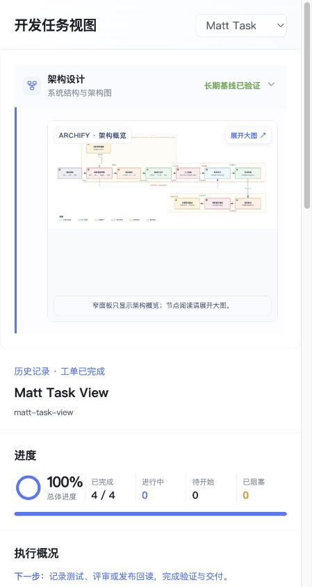
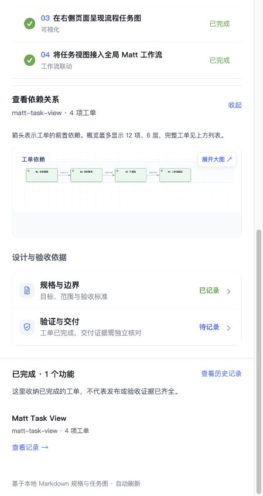

# 开发任务视图 · 界面导览

图片来自本仓库正式服务在 Codex 侧栏内的网页实拍，拍摄于 2026-09-04，不含应用外框。开发区只展示 Matt Task View 的 4 张实际开发工单，均已完成，截图没有制造进行中或受阻状态。

## 当前工作与历史


默认聚焦待处理功能，优先显示有进行中工单的功能。全部完成时显示“当前没有待开发工单”，历史规格、架构与工单收在“已完成”。工单完成但仍有架构门禁、实际复核或基线提升待处理的功能，不会归入历史。

“架构设计门禁与中文架构阶段卡片”归入架构参考资料，从顶部带图标的“架构设计”入口查看。它不会再出现在开发功能、工单历史、进度或任务依赖图中。



## 工单是执行主界面


选择一个功能后，只统计该功能的进度和状态。执行概况给出下一步，工单按进行中、受阻、可开始、其余待开始、已完成排序。列表直接显示当前任务或等待原因，展开后保留完整验收项、源文件位置、架构修订和受影响组件。

验收标记独立于任务状态：`[ ]` 尚未实现，`[~]` 已实现未验收，`[x]` 已验收。网页只读，不提供修改或批准操作。

## 依赖图按需查看



工单下方的“查看依赖关系”默认收起，展开时才加载 Archify。节点横向排列，箭头表示前置依赖；不再显示重复的任务快捷按钮，也不把任务阶段着色成用户界面、Agent 或数据组件。跨功能依赖单独列出。

侧栏概览最多显示 12 项、6 层；完整工单保留在上方列表和大图详情中。点击“展开大图”可使用查找、路径和缩放。折叠状态在本页数据刷新及功能切换后保留，重新加载页面恢复默认收起。

## 规格是依据，架构是系统设计


“设计与验收依据”放在工单之后，包含：

- **规格与边界**：目标、范围和验收标准的简短摘要，完整规格原文按需展开。规格未单独列出验收标准时，从工单提取前三项并注明总数。
- **架构设计**：有架构记录时才显示；保留当前、目标、实际、长期基线和批准修订。待批准或待复核时自动展开提示。
- **验证与交付**：单独核对测试、评审和发布证据。当前没有自动导入证据的能力，工单 100% 不代表已发布。


这里的系统架构产物与任务依赖图分别展示、分别校验。已批准的组件链接可以定位大图节点；批准过期或绑定不可验证时，保留诊断并限制可执行前沿。

## 自己运行查看

```sh
git clone https://github.com/951655087/matt-task-view.git
cd matt-task-view
node src/cli.mjs serve --port 0
```

更多用法见 [README](../README.md)，数据与凭据边界见 [认证与请求流程](认证与请求流程.md)。
