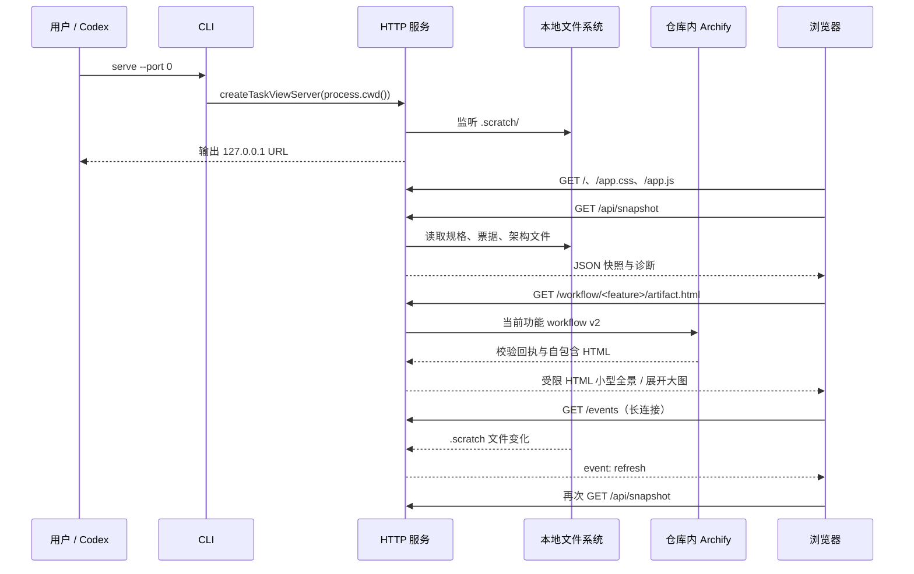

# 认证、请求流程与凭据处理

本文描述 `src/` 下正式任务视图服务的当前实现。它是可信本机环境中的只读工具，**没有应用层身份认证**。能访问服务端口的进程无需用户名、密码或 Token 即可读取任务快照。

## 组件及职责

| 组件 | 代码入口 | 职责与边界 |
| --- | --- | --- |
| 命令入口 | [`parseOptions`、`main`](../src/cli.mjs) | 只允许 `serve`，校验端口和本机 Host；以 `process.cwd()` 为根目录 |
| HTTP 服务 | [`createTaskViewServer`](../src/server.mjs) | 实际监听固定为 `127.0.0.1`；所有接口只接受 GET |
| 数据读取 | [`buildTaskGraph`](../src/task-graph.mjs) | 读取本地规格、票据和架构文件；检查依赖、状态、批准修订及实际架构 |
| 工作流适配与交付 | [`workflowSpecification`、`deliverWorkflow`](../src/workflow.mjs) | 按功能把任务 DAG 转成 workflow v2，调用仓库内固定的 Archify CLI，并核对 9 项校验及输入/输出 SHA-256 |
| 产物访问检查 | [`architectureFiles`](../src/server.mjs) | 限制功能目录名，使用 `realpath` 拒绝架构路由中的目录或文件符号链接跳转 |
| 产物校验 | [`architectureSnapshot`、`readVerifiedArchitectureArtifact`](../src/task-graph.mjs) | 检查决定、源 JSON、HTML 与交付回执；判断可展示性与开发门禁 |
| 浏览器界面 | [`refresh`、`render`](../src/public/app.js) | 获取快照，转义文本并渲染；用 `EventSource` 接收刷新事件；沙箱内嵌架构 HTML |
| 开发流程契约 | [companion skill](../skills/matt-task-view/SKILL.md) | 规定批准与任务发布的先后顺序；视图本身没有批准按钮或写入 API |

## 正常请求流程



服务端文件监听以 30 毫秒延迟合并变化通知。SSE 事件只表示“文件已变化”，不直接包含完整任务；浏览器收到事件后重新取快照。连接关闭时移除客户端；进程收到退出信号后关闭监听与连接。

请求全程不经过认证中间件：不解析 `Authorization`，不验证 Cookie，不交换 Token。快照包含票据内容、规格片段、架构状态和文件路径；其中路径可能是本机绝对路径，数据没有额外脱敏层。

## HTTP 接口

| 请求 | 返回及检查 |
| --- | --- |
| `GET /` | 主 HTML，附主页面 CSP |
| `GET /app.css`、`GET /app.js` | 固定资源白名单，不是任意文件服务器 |
| `GET /api/snapshot` | 调用 `buildTaskGraph`，返回 JSON，成功响应为 `Cache-Control: no-store`；读取失败返回通用 500 错误 |
| `GET /events` | SSE 长连接，发送 `refresh` 事件；不要求凭据 |
| `GET /workflow/<feature>/artifact.html` | 确认功能存在且名称安全，将当前任务图交给固定版本 Archify 生成；交付失败返回通用 422 |
| `GET /architecture/<feature>/artifact.html` | 校验路径与产物，成功返回沙箱 HTML；有效路径下的不可展示产物返回 409，路径或读取异常返回 404 |
| `GET /favicon.ico` | 204 |
| 其他路径 | 404 |
| 任意非 GET 请求 | 405，`Allow: GET` |

## 架构 HTML 的访问流程

1. 对 URL 中的功能名解码，拒绝空值、`.`、`..`、斜杠、反斜杠及空字符。
2. 取得根目录真实路径，验证 `.scratch`、功能目录、架构目录及四个文件没有符号链接跳转。
3. 读取 `decision.json`、`system.architecture.json`、`system.architecture.html` 和 `system.architecture.receipt.json`。
4. 校验结构与回执中的 SHA-256、字节数，再计算展示状态。
5. 通过后返回 HTML，附 `no-store`、`nosniff`、`same-origin` 资源策略及受限 CSP；前端 iframe 也使用 `sandbox="allow-scripts"`。

产物 CSP 允许内联脚本与样式以支持已生成图表，但禁用网络连接、对象、表单提交；沙箱未授予 `allow-same-origin`。剪贴板和全屏权限被禁用。主页面的脚本、样式、连接及 iframe 来源限制为本站。

**可展示与可执行是两个判断。** 如果源 JSON 已改变，而上次交付 HTML 仍与有效回执一致，界面可以展示上次有效图，同时标记批准过期并锁定相关新任务。HTML 被修改后与回执不一致时，不再返回该产物。相关回归见 [server.test.mjs](../test/server.test.mjs)。

上述 `realpath` 检查属于架构 HTML 路由；不能据此推断所有快照文件读取都具有相同的文件系统隔离。项目根目录及本机文件写入者属于当前信任边界。

## Archify 任务图的生成流程

1. 对功能名执行与架构路由相同的字符拒绝，并确认它存在于当前 `TaskGraph.features`。
2. 只选取该功能的任务；依赖层级成为从左到右的列，组内并行任务进入独立泳道。小型全景最多显示前 12 个节点和前 6 个依赖层级，完整任务仍列在 Archify 的任务索引卡片与页面任务列表中。
3. 用临时目录写入 workflow v2 JSON，调用仓库内固定提交的 `archify deliver workflow --quality showcase --json`；显式关闭版本检查，因此生成过程不联网。
4. 只有交付成功、9 项检查全部通过、零错误、零警告，且输入 JSON 与输出 HTML 摘要均匹配回执时才返回 HTML。临时目录随后删除。
5. 相同功能和规格的成功结果在当前服务进程内复用；生成失败会清除缓存，下一次请求可重新尝试。

Archify 来源、固定提交、MIT 许可证和第三方说明保存在 [`vendor/archify/UPSTREAM.md`](../vendor/archify/UPSTREAM.md)。任务图响应沿用架构产物的 CSP、沙箱、权限策略和禁止联网规则。

## 凭据和 Token 如何处理

| 项目 | 当前处理 |
| --- | --- |
| 用户名、密码 | 无用户系统，不接收、不存储、不校验 |
| OAuth / JWT / API Key | 未实现；不创建、刷新、撤销或传输应用 Token |
| Cookie / Session | 不设置会话 Cookie，不建立服务端 Session |
| 浏览器持久凭据 | 正式前端不使用 localStorage/sessionStorage 保存凭据；筛选状态保留在页面变量中 |
| GitHub 凭据 | 应用不访问 GitHub，不读取 GitHub CLI 配置、操作系统钥匙串或 Git 凭据助手 |
| Archify | 使用仓库内固定运行文件；禁用更新检查，不接收凭据，也不调用远端 API |
| 架构 SHA-256 | 用于固定文件修订与完整性；是普通摘要，不是秘密，不证明写入者身份 |
| 批准字段 | 从本地 JSON 读取声明的批准摘要并核对当前字节；真实人工批准由外部流程负责 |

例如，CLI 的本机限制是：

```js
if (host !== "127.0.0.1") throw new Error("For local privacy, matt-task-view only listens on 127.0.0.1.");
```

服务器再次固定监听地址：

```js
server.listen({ host: "127.0.0.1", port }, /* 启动回调 */);
```

这些措施限制网络可达性，但没有识别“当前用户是谁”。拥有本机文件写权限的人可以同时修改产物、回执和批准字段；无密钥摘要不能防止这种整体改写。

将代码推送到 GitHub 是独立的 Git/CLI 操作，认证由执行推送的工具及其凭据存储负责，不经过本应用的 HTTP 服务。不要把个人 Token 写入本仓库；`.gitignore` 排除常见 `.env` 文件，但不是内容脱敏或秘密检测系统。

## 适用范围与验证

服务适用于可信本机环境，没有多用户隔离、TLS、Host/Origin 白名单、DNS rebinding 专项防护或访问审计。CSP、只读方法与回环监听不能替代身份认证；直接改成共享服务需要单独设计访问控制。

架构门禁影响界面与可执行前沿，不会阻止其他程序直接编辑票据、运行代码或提交 Git。它提供事实校验和工作流提示，不是操作系统权限控制器。

运行 `npm test` 可验证现有回归：非回环 Host 拒绝、路径编码与符号链接拒绝、产物篡改拒绝、过期产物行为、SSE，以及架构批准与基线校验。当前测试通过不代表经过公网安全审计。
